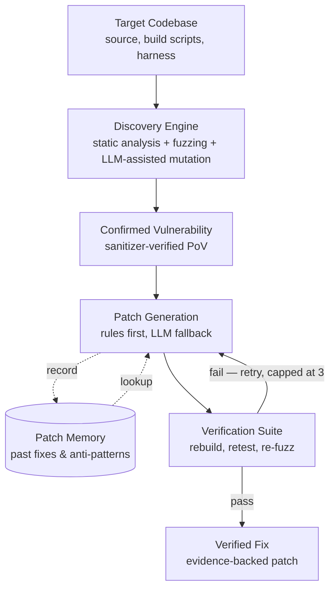

# AI Kavach — Autonomous Cyber-Reasoning System (CRS)

> Find the bug. Prove it's real. Fix it. Prove the fix holds. All without a human in the loop.

**Competition:** AI Kavach track, Terrier Cyber Quest 2026 (Indian Army)
**Team size:** up to 3 members
**Document version:** v1.0 — 2026-08-25 (post-architecture-review, includes Patch Memory)
**Project stage:** Pre-shortlist — architecture defined, prototype in progress
**This file is:** the single source of truth for this project. Read it fully before writing or generating any code. It exists so that any engineer — human or AI agent — can pick this project up cold and build correctly without needing prior conversation history.

---

## 0. Quick orientation (read this first if you're an agent)

1. Read **§4 (Design Philosophy)** before touching code — it explains *why* the architecture is shaped the way it is, and getting this wrong (e.g. defaulting to "one big LLM agent does everything") is the single most common failure mode for this kind of project.
2. Read **§5 (Architecture)** for the exact pipeline — 7 sequential stages plus 2 supporting services.
3. Read **§8 (Definition of "Proof")** before implementing the verification stage — it is the precise, non-negotiable acceptance test for what counts as a proven fix.
4. Check **§13 (Current State)** — some components reportedly already have initial implementations from a prior session. Locate and review existing code before writing new code, to avoid duplicate work.
5. Everything else is supporting context: competition rules, research justification, tech choices, repo layout, build plan.

---

## 1. Mission, in one paragraph

Build a system that takes in a piece of software, automatically finds a real, reproducible security vulnerability in it, writes a code patch that fixes it, and then *proves* — with evidence, not just a claim — that the patch actually closes the vulnerability without breaking anything else. It must run autonomously (no human clicking "next"), must be fast and resource-light rather than throwing maximum compute at every step, and must be able to explain what it found and why the fix is correct in a way a judge or an Army evaluator can verify at a glance.

---

## 2. Competition Context

### 2.1 The event

- **Terrier Cyber Quest 2026**, organized by the Indian Army, with three tracks: **AI Kavach** (this project), Bug Hunting, and Creators Challenge.
- Registration closed **August 20, 2026**. Shortlisting phase: **September 1–10, 2026**. Grand Finale: **October 6–8, 2026**, New Delhi.

### 2.2 The problem statement, as given (verbatim)

> **Competition Format:** The AI Kavach is a data-centric innovative challenge designed to test participants' ability to build robust technological solutions/models that can detect, analyse and solve real-world problems related to defence and national security.
>
> Build a cyber-reasoning system — an LLM laced with fuzzers, static and dynamic analysis, and a regression test harness — that autonomously finds a vulnerability, patches it, and proves the fix holds. The solutions worked out in the finale by the teams shall be pitched to run autonomously against specific customised infrastructure of the Indian Armed Forces.
>
> **Participation guidelines:** Teams of maximum 3 members (including team leader). Submit a PPT of no more than 5 slides: (1) Introduction/Ideation/Brief Description, (2) Detailed Methodology, (3) Technology Stack/Flow Diagram/Block Diagram/Equipment Used, (4) Salient Features & Novelty/USP, (5) Final Deliverables.
>
> **Shortlisting scoring:** resource utilisation, novelty of idea, how lightweight the solution is.
>
> **Grand Finale:** in-person 36-hour build. Shortlisted teams refine their solution into a working prototype with mentor support. Evaluated on performance, speed, precision, functionality, and scalability. Final prototypes are tested against a **simulated Indian Armed Forces software environment**.

### 2.3 What this means for engineering decisions

Three scoring dimensions recur across both the shortlist stage and the finale: **lightweight/resource-efficient**, **fast**, and **scalable to real (large, unfamiliar) codebases**. Every architecture decision in this document is made in service of those three, backed by evidence from the closest real-world precedent to this exact challenge (§3).

---

## 3. Research Foundation — this is not a novel problem

This exact brief — "an LLM laced with fuzzers, static/dynamic analysis, and a regression harness that autonomously finds, patches, and proves a fix" — is a scaled-down version of **DARPA's AI Cyber Challenge (AIxCC)**, a two-year, $8.5M competition that concluded in August 2025. All 7 finalist teams open-sourced their systems. We are treating this as our primary reference dataset, not just inspiration.

### 3.1 Final results (grounding for architecture decisions)

| Team | System | Final Score | Result |
|---|---|---|---|
| Team Atlanta | Atlantis | 392.8 | 1st, $4M |
| Trail of Bits | **Buttercup** | 219.4 | 2nd, $3M — **our primary template** |
| Theori | RoboDuck | 210.7 | 3rd, $1.5M (lost 2nd on an accuracy penalty) |
| Academic team (Texas A&M) | FuzzingBrain | 153.7 | 4th |
| Shellphish | Artiphishell | 135.9 | 5th |
| Academic team (Northwestern) | BugBuster | 105.0 | 6th |
| Industry team | Lacrosse | 9.6 | 7th — effectively did not finish |

### 3.2 Why Buttercup (Trail of Bits) is the primary template

Buttercup is the only top-3 system explicitly engineered to be lightweight: it runs on a single laptop (8 CPU cores, 16GB RAM, 100GB disk, one LLM API key), found 28 vulnerabilities across 20 bug categories at 90% accuracy for roughly **$181 per point scored**, and did this using only cheaper "non-reasoning" LLMs rather than frontier reasoning models. Its design philosophy — deterministic, well-decomposed workflows with LLMs used only where plain tools fall short — is the single best-evidenced match for what this competition's scoring criteria (lightweight, resource-efficient) actually reward. It is fully open source: [github.com/trailofbits/buttercup](https://github.com/trailofbits/buttercup).

### 3.3 Key findings from the competition that directly shape this design

- **Stability beat sophistication.** The winner won mainly by staying operational across the entire competition while two technically strong competitors (Buttercup included) stopped scoring partway through. A system that reliably applies basic techniques without crashing would have placed top-3. **Implication: engineering robustness and circuit-breakers matter as much as clever AI.**
- **Automated checks are not proof.** Patches that passed every automated check (build succeeds, known crash is gone, old tests pass) were still semantically wrong ~40% of the time under manual review — wrong root cause, incomplete fix, or a subtle behavior change tests didn't catch. **Implication: our verification stage needs a check beyond "the known crash input no longer crashes" — see §8.**
- **Fuzzing alone is weak on logic bugs.** Plain fuzzing found 75% of C memory-corruption bugs but only 17% of Java-style logic bugs. LLM reasoning earned its keep specifically on: tracing through indirect/function-pointer calls, constructing valid inputs for structured formats, and satisfying logic guards (regex, encoding checks) that block naive random mutation. **Implication: don't route everything through the LLM — target it at the cases fuzzing structurally can't solve.**
- **A single unconstrained process nearly ended one team's competition.** Lacrosse generated over 1,200 proof-of-vulnerability inputs for a single bug before crashing from resource exhaustion. **Implication: hard budgets (time, $, tokens) per bug are mandatory, not optional.**
- **Both 1st and 2nd place built their agent orchestration on LangGraph** (a Python library) — a proven, low-risk choice for our own orchestration layer.

Further reading: [SoK: DARPA's AI Cyber Challenge (AIxCC)](https://arxiv.org/abs/2602.07666) (academic comparison of all 7 architectures); [Buttercup is now open source](https://blog.trailofbits.com/2025/08/08/buttercup-is-now-open-source/) (Trail of Bits' own architecture writeup).

---

## 4. Design Philosophy — read before writing code

The trap almost every team will fall into is treating "AI" as the answer to every step: one large LLM agent that reads the whole codebase and reasons through everything. That approach is slow, expensive, fragile, and directly contradicts the scoring criteria. This project follows the opposite pattern, validated by the research above:

- **Mostly boring, fast, free tools do the grunt work. The LLM steps in only at moments that genuinely need judgment.** A compiler warning doesn't need an LLM. A fuzzer crash doesn't need an LLM to notice — a sanitizer already reports that for free. The LLM earns its keep at exactly two moments: (1) deciding what a confusing crash *means*, and (2) writing a patch for cases a simple rule can't handle.
- **Deterministic pipeline over freeform agent.** Each stage has a defined input, output, and (mostly) no LLM involvement, except where explicitly noted.
- **Cheap/fast model by default; escalate to a stronger model only on failure.** Never default to the most expensive reasoning tier for routine calls.
- **Never paste a whole file or repo into an LLM prompt.** Build a queryable code index first (§5.2, Context Map); retrieve only the relevant slice for any given reasoning step. All 7 AIxCC finalists did some form of this — it is the only approach proven to scale to million-line codebases.
- **Sanitizers are ground truth. The LLM's opinion is not.** "Did this crash under a sanitizer" is a fact. "Does this code look buggy" is a guess. Lean on the fact wherever possible.
- **Design for an unknown target.** The exact language/shape of the Grand Finale's "customised Indian Armed Forces infrastructure" is not known yet. Keep the pipeline's control logic language-agnostic even though the first working build targets C — don't hardcode assumptions that only work on the demo target.
- **Graceful degradation over single point of failure.** If the LLM API hiccups or rate-limits mid-demo, the deterministic tiers (fuzzing, static analysis, rule-based patches) must keep producing partial value, not stop entirely.

---

## 5. Architecture

### 5.1 Pipeline diagram



A supporting service, the **Context Map** (§5.2, Stage 3), is not drawn as its own pipeline box — it sits underneath and is queried by both the Discovery Engine and Patch Generation stages.

### 5.2 Stage-by-stage specification

**Stage 1 — Task Intake & Build Harness**
*Input:* target codebase + its build instructions. *Output:* two compiled builds — one normal, one with sanitizers enabled (AddressSanitizer for memory bugs, UndefinedBehaviorSanitizer for undefined-behavior bugs — compiler flags that make bugs crash loudly and informatively instead of silently corrupting memory). Runs inside a disposable container so every run starts from an identical clean state.
*LLM involvement:* **none.** This must be boring and rock-solid — if this stage is flaky, nothing downstream can be trusted.

**Stage 2 — Discovery Engine**
*Input:* the sanitizer-instrumented build. *Output:* candidate crashing inputs. Two things run in parallel (this is the main lever for speed, not sequencing):
- A mutation-based fuzzer (libFuzzer or AFL++) throws large volumes of malformed input at the binary.
- A static analyzer (Semgrep or cppcheck) scans source for known-dangerous patterns (unchecked copies, missing bounds checks, use-after-free shapes) without executing anything, and feeds suspicious locations to the fuzzer as places to prioritize.
*LLM involvement:* **light** — used to generate smarter fuzzing seeds/mutations for hard-to-reach code, not to review every input.

**Stage 3 — Context Map** *(supporting service, not a sequential stage)*
*Input:* the target codebase, built once per target before any patch-writing happens. *Output:* a lightweight, queryable index of the codebase (function names, file locations, call relationships) built with tree-sitter. When a later stage needs to reason about a specific crash, it retrieves only the relevant function plus its immediate neighbors — a few hundred lines — instead of the whole file or repo.
*LLM involvement:* **none to build; saves LLM tokens on every later step.** This is the single highest-leverage decision for controlling cost on large codebases.

**Stage 4 — Confirmed Vulnerability (PoV)**
*Input:* a candidate crashing input from Stage 2. *Output:* a confirmed, reproducible proof-of-vulnerability. Replay the exact input, confirm the sanitizer flags it again deterministically. Discard anything that doesn't reproduce.
*LLM involvement:* **none.** Pure re-execution and exit-code/stderr inspection.

**Stage 5 — Tiered Patch Generation** *(consults Patch Memory)*
*Input:* a confirmed PoV + its Context Map slice. *Output:* a candidate patch. Three tiers, tried in order:
1. **Rule library.** Instant, template-based fixes for well-known patterns ("unchecked length copied into a fixed buffer → insert a bounds check"). No LLM call.
2. **Patch Memory lookup** (see §5.3). If a similar bug pattern was fixed and verified before, either reuse the pattern directly or hand it to the LLM as a few-shot example.
3. **LLM fallback.** Only when tiers 1–2 don't resolve it. Give the LLM only the Context Map slice, ask for only the patched function back (not the whole file), and default to a cheap/fast model — escalate to a stronger model only if the cheap one fails on its first attempt.
*LLM involvement:* **this is where nearly all token spend should be concentrated, and it should be the minority path, not the default.**

**Stage 6 — Verification Suite**
*Input:* a candidate patch. *Output:* pass/fail against the full proof checklist in §8. Rebuild with the patch → replay the original crashing input (must no longer crash) → run the project's existing test suite (must still pass) → briefly re-fuzz around the patch (mutate the original input slightly; if a nearby variant still crashes, the patch was too narrow). On failure, the specific failure reason is sent back to Stage 5 for another attempt, **capped at 3 retries** — a stuck bug must not consume the whole time/token budget.
*LLM involvement:* **none, except a short, specific retry prompt on failure** (not a re-run of the whole problem from scratch).

**Stage 7 — Evidence Report**
*Input:* a verified patch. *Output:* a human-readable report packaging the original crashing input, before/after sanitizer output, test results, and a short plain-language explanation of the root cause.
*LLM involvement:* **cheap — at most one short summary call.** Disproportionately high-value for demo/judging purposes since it's the part a human actually looks at.

### 5.3 Patch Memory

A case-based-reasoning store (a well-established software engineering research pattern, not a novel invention) that lets the system get cheaper and more consistent over time instead of re-reasoning every bug from scratch.

**How it works:** every time the LLM tier (Stage 5, tier 3) successfully produces a *verified* patch, log an entry. The next time a similar bug pattern appears, either skip the LLM entirely (treat it as a new rule) or hand the LLM the precedent as a few-shot example — fewer tokens, more consistent fixes.

**What to store per entry (keep each one small):**
- Bug class / CWE tag (e.g. "unchecked length → fixed buffer")
- One-line root-cause description — not the raw diff
- The fix template/pattern used
- Outcome — only log entries that survived the *full* Stage 6 verification loop

**Matching:** by pattern (bug class + code shape), not exact code or byte match — matching on literal repeats only fires rarely and defeats the purpose.

**Critical caution:** never let the model copy a precedent blindly. A past fix applied to a superficially similar but actually different context is exactly how "shallow" patches happen. Every Patch Memory suggestion is a *hint* that must still pass the full §8 verification checklist — never a shortcut around it.

**Where it lives architecturally:** sits next to the Context Map (Stage 3), feeds Stage 5 only.

---

## 6. Definition of "Proof" — the acceptance test for a verified fix

This operationalizes the problem statement's phrase "proves the fix holds." A patch is only accepted if **all four** of the following pass. This is not negotiable — it is the core deliverable of the entire project.

| Check | What it verifies |
|---|---|
| **V1 — Clean rebuild** | The patched code compiles/builds without errors. |
| **V2 — Original PoV replay** | The exact input that caused the original crash no longer triggers the sanitizer when run against the patched build. |
| **V3 — Regression suite** | The project's existing test suite still passes in full — the patch did not break other functionality. |
| **V4 — Differential re-fuzz** | Mutate the original crashing input slightly and fuzz briefly around the patch. No new/related crash should surface nearby. This catches patches that only silence the *exact* reported input without fixing the underlying defect (a documented failure mode in the reference competition — see §3.3). |

Failing any check routes the specific failure reason back to Stage 5, capped at 3 attempts (see §5.2, Stage 6), after which the case is flagged rather than silently dropped or endlessly retried.

**Do not accept a patch on V1–V3 alone.** V4 exists specifically because automated checks without it were shown to pass semantically wrong patches roughly 40% of the time in the reference competition data.

---

## 7. Tech Stack & Versions

| Layer | Choice | Notes |
|---|---|---|
| Language / runtime | **Python 3.12** (3.13 acceptable) | As of Aug 2026, Python 3.14 is the newest stable line, but 3.12/3.13 currently have broader compatibility with fuzzing/binding libraries. Verify library support before adopting 3.14. |
| Backend / orchestrator | **FastAPI** + Uvicorn | Matches existing team experience. Use latest stable at setup time. |
| Agent orchestration | **LangGraph** | Used by both 1st- and 2nd-place AIxCC teams for exactly this kind of agent pipeline. |
| Fuzzing (C/C++) | **libFuzzer** (via LLVM/Clang) and/or **AFL++** | Use latest stable release; both are free and mature. |
| Fuzzing (other languages, if scope expands) | Jazzer (Java), Atheris (Python) | Only needed if the finale target isn't C/C++. |
| Sanitizers | **AddressSanitizer (ASan)**, **UndefinedBehaviorSanitizer (UBSan)** | Compiler flags, not separate installs. Note: some bug classes (e.g. signed integer overflow) need UBSan specifically — ASan alone will miss them. |
| Static analysis | **Semgrep**, or **cppcheck** | Semgrep is easier to get running fast in a hackathon timeframe. |
| Code indexing | **tree-sitter** (+ grammar for target language) | Same tool Buttercup uses for its context map. |
| LLM | **Anthropic Claude API** — cheap/fast tier as default (e.g. Haiku-class model), escalate to a stronger tier (e.g. Sonnet-class) only on retry | Team has direct prior experience with this API. |
| Containerization | **Docker** | Isolated, disposable build/fuzz environments — required for Stage 1. |
| Dashboard | **React** (Vite) | Matches existing full-stack experience. |
| Patch Memory store | **SQLite** or a JSONL file to start | No need for a vector database at hackathon scale; upgrade to embedding-based similarity search later only if time allows. |
| Version control | **Git / GitHub** | — |

---

## 8. Proposed Repository Structure

```
ai-kavach-crs/
├── README.md                    # this file
├── docker-compose.yml
├── orchestrator/                # FastAPI app — the conductor
│   ├── main.py
│   ├── pipeline/
│   │   ├── build_harness.py     # Stage 1
│   │   ├── discovery.py         # Stage 2
│   │   ├── context_map.py       # Stage 3 (supporting service)
│   │   ├── confirm_pov.py       # Stage 4
│   │   ├── patch_gen.py         # Stage 5
│   │   ├── patch_memory.py      # §5.3
│   │   └── verify.py            # Stage 6 (implements V1–V4 from §6)
│   ├── models/                  # request/response schemas
│   └── config.py                # budgets, model tiers, retry caps
├── fuzzing/
│   ├── harnesses/                # per-target fuzz harnesses
│   └── afl_configs/
├── static_analysis/
│   └── semgrep_rules/
├── targets/                      # sample vulnerable targets for demo/testing
│   └── example-target/
├── dashboard/                     # React frontend — Stage 7 evidence report UI
│   ├── src/
│   └── package.json
├── data/
│   └── patch_memory.db           # or .jsonl
└── docs/
    ├── architecture.png           # the pipeline diagram
    └── slides/                    # source files for the 5-slide PPT
```

---

## 9. Engineering Guardrails — non-negotiables

1. Cheap/fast model by default; escalate only on failure (§4).
2. **Hard budget per bug** — time, dollars, and tokens — enforced with a circuit breaker. Reference: Lacrosse's system generated 1,200+ PoVs for one bug and crashed from resource exhaustion, scoring 9.6 out of a possible several hundred points. This is the failure mode we are explicitly building against.
3. Sanitizer output is ground truth; LLM judgment is not. Only ask the LLM to judge what a sanitizer structurally can't see (logic bugs, auth bypasses).
4. **Deduplicate before patching.** The same underlying bug can surface as many different crashing inputs — merge by crash signature/location before spending any patch effort.
5. Support both **Full Scan** (entire codebase) and **Delta Scan** (only a diff/PR). Delta mode is cheaper, faster, and more realistic for reviewing incoming changes to real software — lead demos with it.
6. Keep the pipeline's control logic language-agnostic even though the first working build targets C — the finale target is not yet known.
7. **Graceful degradation.** If the LLM API is unavailable or rate-limited, Stages 1, 2 (fuzzing portion), 3, 4, and the rule-based tier of Stage 5 must keep functioning.
8. **Don't let a patch just hide the crash.** Check that a patch touches the actual root-cause location, not only the line the sanitizer flagged — a cheap structural check, and a specific failure mode judges familiar with this space will probe for.
9. Patch Memory entries are hints that still must pass full §8 verification (V1–V4) — never a bypass.

---

## 10. Build Plan

**Phase 0 — now → PPT submission (shortlist stage).**
Priority is a working proof-of-concept on *one* sample vulnerable target that demonstrates Stages 1, 2, and 4 end-to-end (find → confirm), ideally with a real number to quote in the pitch (e.g. time-to-find, cost-per-bug). Does not need to be feature-complete.

**Phase 1 — if shortlisted, before the Grand Finale.**
Get the full loop (find → patch → verify → report) working reliably across 2–3 sample targets. Harden the rule-based patch tier. Get Patch Memory logging real entries. Deliberately stress-test for resource exhaustion and crashes (see Guardrail 2) rather than only testing the happy path.

**Phase 2 — the 36-hour Grand Finale.**
Adapt to whatever the actual target environment turns out to be. Prioritize **not crashing** over adding new features — the reference competition data (§3.3) shows this is what actually separates 1st place from the rest. Keep the Stage 7 evidence dashboard polished, since it's what judges directly see and interact with.

---

## 11. Current State

A prior working session reports initial implementations already exist for: a vulnerable demo target, a fuzzer, a triage/crash parser, and a tiered patcher — corresponding to Stages 1, 2, 4, and 5 above. **Locate and review this existing code before starting new implementation** to avoid duplicate work. Patch Memory (§5.3) is a newly finalized design and, as of this document's version, has not yet been implemented.

---

## 12. References

- Trail of Bits — Buttercup source code: https://github.com/trailofbits/buttercup
- Trail of Bits — "Buttercup is now open source" (architecture writeup): https://blog.trailofbits.com/2025/08/08/buttercup-is-now-open-source/
- "SoK: DARPA's AI Cyber Challenge (AIxCC): Competition Design, Architectures, and Lessons Learned" (academic comparison of all 7 finalist architectures): https://arxiv.org/abs/2602.07666
- Team Atlanta's own technical write-up (1st place): https://team-atlanta.github.io/blog/post-atl/
- DARPA AIxCC official finals results: https://aicyberchallenge.com/finals-winners-announcement/
